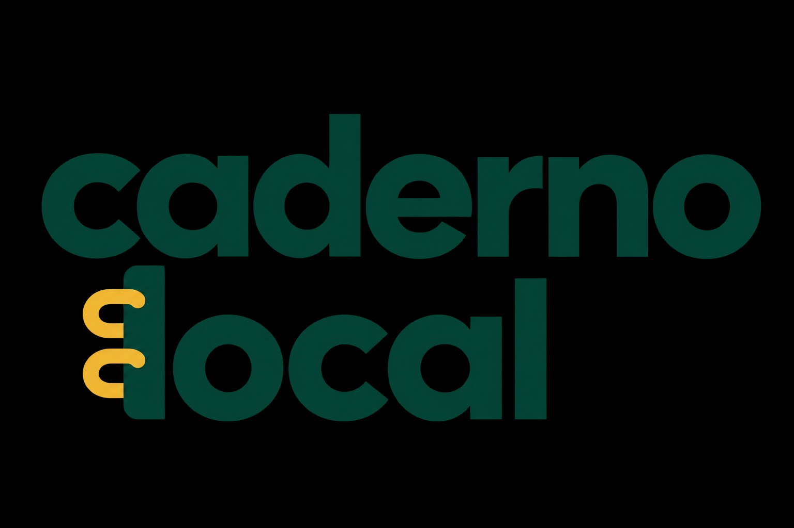
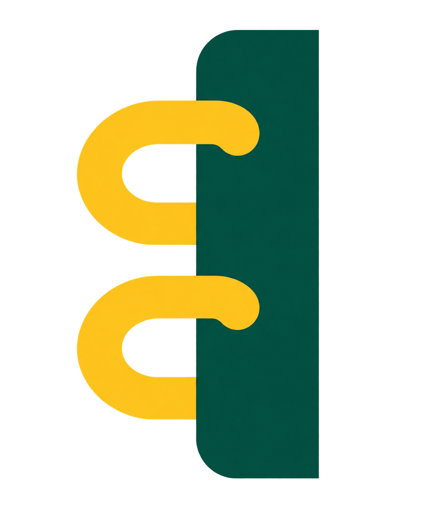

<div align="center">



<br>

# Caderno Local

### Seu banco de questões. Seus concursos. Seus dados.

**Caderno Local** é um projeto open source para criar e estudar bancos de questões personalizados para qualquer concurso, com foco em organização, desempenho, revisão de erros e liberdade sobre o próprio acervo.

[](#-licença)
[](#-tecnologias)
[](#-tecnologias)
[](#-tecnologias)

<br>

[Visão geral](#-visão-geral) •
[Funcionalidades](#-funcionalidades) •
[Instalação](#-instalação) •
[Como usar](#-como-usar) •
[Roadmap](#-roadmap) •
[Contribuindo](#-contribuindo)

</div>

---

## 📌 Visão geral

Estudar para concurso costuma significar espalhar questões entre PDFs, sites, planilhas, cadernos e plataformas diferentes.

O **Caderno Local** nasceu para centralizar isso.

A proposta é simples: você monta o seu próprio banco de questões, organiza o acervo da forma que fizer sentido para o seu concurso e acompanha sua evolução sem depender de uma plataforma fechada ou de um catálogo específico.

O projeto foi criado inicialmente para preparação em concursos técnicos, mas sua arquitetura é pensada para ser **genérica e reutilizável em qualquer concurso**.

> **Organize provas, acompanhe sua evolução e transforme cada erro em um próximo passo de estudo.**

---

## 🖼️ Interface

A barra lateral usa a assinatura branca completa, enquanto a página inicial mostra uma ilustração própria de caderno e o ícone do navegador usa o símbolo verde e amarelo. As capturas de tela da versão pública serão adicionadas quando o pacote de demonstração estiver pronto.

---

## ✨ Por que o Caderno Local?

Plataformas de questões são ótimas, mas nem sempre possuem exatamente o acervo que você quer estudar.

O Caderno Local parte de outra lógica:

- **você controla o banco de questões;**
- **você escolhe quais concursos e provas entram;**
- **você define como as questões são classificadas;**
- **seus dados de estudo ficam sob seu controle;**
- **o projeto pode ser adaptado para diferentes concursos e áreas.**

Isso permite transformar provas antigas, planilhas próprias e bancos temáticos em um ambiente único de estudo.

---

## 🚀 Funcionalidades

### 📚 Banco personalizado

Importe e organize questões usando informações como:

- concurso;
- órgão ou empresa;
- banca;
- cargo;
- ano;
- data;
- matéria;
- assunto;
- dificuldade;
- prioridade.

### 🔎 Filtros

Encontre rapidamente o que deseja estudar.

Exemplos:

> `Transpetro → Cesgranrio → Técnico de Manutenção – Mecânica → Metrologia → Paquímetro`

ou:

> `Todas as questões difíceis de Mecânica dos Fluidos que ainda não resolvi`

### ✅ Resolução de questões

Ambiente próprio para estudo com:

- alternativas de múltipla escolha;
- questões do tipo **Certo / Errado**;
- registro da resposta marcada;
- correção;
- tempo gasto;
- histórico de tentativas.

### ⏱️ Cronometragem

Acompanhe quanto tempo você leva para resolver cada questão e use esse dado para melhorar velocidade de prova.

### 🔁 Revisão de erros

Questões erradas podem voltar para uma fila de revisão.

```text
Questão
   ↓
Resposta
   ↓
Erro identificado
   ↓
Assunto
   ↓
Revisão
   ↓
Nova tentativa
```

### 📊 Dashboard

Acompanhe sua evolução com indicadores como:

- total de questões resolvidas;
- acertos;
- percentual de aproveitamento;
- dias ativos;
- desempenho por matéria;
- desempenho por assunto;
- questões resolvidas por dia;
- pontos fortes;
- assuntos que precisam de revisão.

### 🧪 Simulados

Monte sessões com filtros específicos ou conjuntos de questões para simular uma prova.

### 📥 Importação de questões

Na página **Importar questões**, baixe `modelo_questoes.xlsx`, copie o prompt para a IA da sua escolha, anexe as provas e seus gabaritos definitivos e confira a planilha resultante. A página mostra seis etapas do processo e permite importar o `.xlsx` validado. A aba deve se chamar `Questoes`. São aceitas questões com quatro ou cinco alternativas ou do tipo Certo/Errado; não invente uma alternativa E em provas de quatro opções.

Uma seção **Ajuda** reúne 56 respostas em oito categorias, com pesquisa por termo. O texto do prompt também pode ser consultado em `docs/prompt-importacao.txt`.

### 🧩 Controle de duplicatas

O banco pode identificar dados usados para evitar importações repetidas da mesma questão.

### 📄 Vínculo com provas originais

Questões podem manter referência à prova ou ao documento de origem, facilitando rastreabilidade do acervo.

---

## 🧠 Filosofia do projeto

O objetivo do Caderno Local não é competir em quantidade com grandes plataformas.

A proposta é oferecer **controle**.

Você pode montar um banco extremamente específico para:

- concursos públicos;
- vestibulares;
- certificações;
- residência;
- provas universitárias;
- processos seletivos;
- estudos internos de empresas.

Um usuário pode ter 200 questões muito bem selecionadas.

Outro pode ter 50.000.

O sistema continua sendo o mesmo.

---

## 🛠️ Tecnologias

| Tecnologia | Uso |
|---|---|
| **Python** | Backend e regras da aplicação |
| **Flask** | Aplicação web |
| **SQLite** | Banco de dados local |
| **HTML** | Estrutura das páginas |
| **CSS** | Interface |
| **JavaScript** | Interações no frontend |
| **Excel / XLSX** | Importação estruturada de questões |

---

## 📦 Instalação

### 1. Clone o repositório

```bash
git clone https://github.com/SEU-USUARIO/caderno-local.git
cd caderno-local
```

### 2. Crie um ambiente virtual

#### Windows

```bash
python -m venv .venv
.venv\Scripts\activate
```

#### Linux / macOS

```bash
python3 -m venv .venv
source .venv/bin/activate
```

### 3. Instale as dependências

```bash
pip install -r requirements.txt
```

### 4. Execute o projeto

```bash
python app.py
```

Abra no navegador:

```text
http://127.0.0.1:5000
```

> Se o ponto de entrada mudar, atualize este trecho da documentação.

---

## 🗂️ Estrutura do projeto

```text
caderno-local/
├── app.py
├── assuntos.py
├── help_content.py
├── simulados.py
├── gerar_paginas.py
├── schema.sql
├── requirements.txt
├── iniciar_windows.bat
├── modelo_questoes.xlsx
├── static/
│   ├── brand.css
│   ├── caderno-local-icon.png
│   ├── caderno-local-branca.png
│   ├── style.css
│   ├── modern.css
│   ├── app.js
│   ├── import_help.js
│   ├── provas/            # documentos locais do usuário
│   └── paginas/           # imagens de páginas geradas localmente
├── templates/
├── docs/assets/brand/     # logos e guia de identidade
├── docs/prompt-importacao.txt
├── imports/               # planilhas pessoais do usuário
├── instance/              # banco e chave locais; não publicar
└── tests/
```

O GitHub deve receber apenas o código e os arquivos da marca. O banco de dados,
planilhas preenchidas, provas e gabaritos pessoais permanecem no computador do usuário.

---

## 📝 Como usar

1. **Baixe o modelo** na página Importar questões.
2. **Envie provas, gabaritos, modelo e prompt à IA** da sua preferência; confira cada questão com os originais.
3. **Copie os PDFs para `static/provas/`** se quiser visualizar figuras nas sessões.
4. **Importe o `.xlsx`** para o Caderno Local.
5. **Filtre** por concurso, banca, matéria ou assunto.
6. **Resolva**, analise o desempenho e revise os erros.

---

## 🎯 Exemplo de uso

O Caderno Local começou sendo utilizado para organizar a preparação para:

**Transpetro — Técnico de Manutenção – Mecânica**

Mas o projeto **não é específico da Transpetro**.

A mesma estrutura pode ser utilizada para qualquer concurso.

---

## 🗺️ Roadmap

### MVP

- [x] Banco local de questões
- [x] Organização por concurso, banca, cargo, matéria e assunto
- [x] Resolução de questões
- [x] Registro de tentativas
- [x] Controle de tempo
- [x] Questões de múltipla escolha
- [x] Questões Certo / Errado
- [x] Importação por `.xlsx`
- [x] Filtros
- [x] Revisão
- [x] Dashboard de desempenho
- [x] Controle de duplicatas

### Próximas evoluções

- [ ] Melhorias nos simulados
- [ ] Estatísticas avançadas
- [ ] Sistema de tags
- [ ] Exportação de desempenho
- [ ] Melhorias na experiência mobile
- [ ] Temas e personalização visual
- [ ] Instalação simplificada
- [ ] Backup e restauração do banco
- [ ] Documentação da API / estrutura interna

### Ideias futuras

- [ ] Assistência por IA
- [ ] Geração assistida de questões
- [ ] Classificação automática
- [ ] Explicações automáticas de erros
- [ ] Sugestões inteligentes de revisão

> Recursos de IA fazem parte das possibilidades futuras, mas **não são o foco do MVP**.

---

## 🎨 Identidade visual

### Cores principais

| Cor | Hex |
|---|---|
| Verde principal | `#044436` |
| Amarelo | `#F0B734` |
| Texto escuro | `#102D28` |
| Superfície | `#F4F8F5` |
| Branco | `#FFFFFF` |
| Apoio | `#536C64` |

### Tipografia

- **Poppins** — títulos (600–700);
- **Inter** — textos e interface (400–600).

As fontes são opcionais no modo offline: quando não estiverem instaladas, o app usa Segoe UI ou Arial como alternativas locais. O desenho da logo não depende da fonte instalada.

Os arquivos da marca ficam em `docs/assets/brand/`. A assinatura branca transparente é usada sobre o verde escuro da barra lateral; o símbolo verde e amarelo é usado como favicon. O desenho da capa é feito em CSS.

[Ver o media kit completo](docs/assets/brand/Caderno_Local_Media_Kit.pdf).

---

## 🤝 Contribuindo

Contribuições são bem-vindas.

Você pode ajudar com:

- correções de bugs;
- melhorias de interface;
- novos filtros;
- relatórios;
- importadores;
- documentação;
- testes;
- acessibilidade;
- performance;
- novas ideias de estudo e revisão.

Fluxo sugerido:

```bash
git checkout -b feature/minha-melhoria
git add .
git commit -m "feat: adiciona minha melhoria"
git push origin feature/minha-melhoria
```

Depois, abra um **Pull Request** descrevendo a alteração.

---

## 🐛 Encontrou um problema?

Abra uma **Issue** informando:

- comportamento esperado;
- comportamento encontrado;
- passos para reproduzir;
- sistema operacional;
- versão do Python;
- prints, se possível.

---

## 🔐 Privacidade

O Caderno Local foi pensado com uma abordagem **local-first**.

Seu banco e seus dados de estudo podem permanecer no seu próprio computador, dando mais controle sobre:

- questões;
- histórico;
- desempenho;
- tentativas;
- informações de estudo.

---

## ⚠️ Questões e direitos autorais

O Caderno Local é uma **ferramenta de organização e estudo**.

O software não precisa distribuir bancos de questões proprietários junto ao código.

Cada usuário é responsável pelo conteúdo importado e pelo uso adequado de questões, provas, imagens e demais materiais adicionados ao sistema.

---

## 📜 Licença

Este projeto é open source.

<!--
Defina a licença do projeto antes da publicação.
Uma opção comum para projetos desse tipo é a MIT License.
-->

**Licença:** a definir.

---

## ⭐ Apoie o projeto

Se o Caderno Local for útil para você:

- deixe uma ⭐ no repositório;
- abra uma Issue com sugestões;
- contribua com código;
- compartilhe o projeto com outras pessoas que estudam para concursos.

---

<div align="center">

### Caderno Local

**Monte seu banco. Estude do seu jeito.**

<br>



</div>
